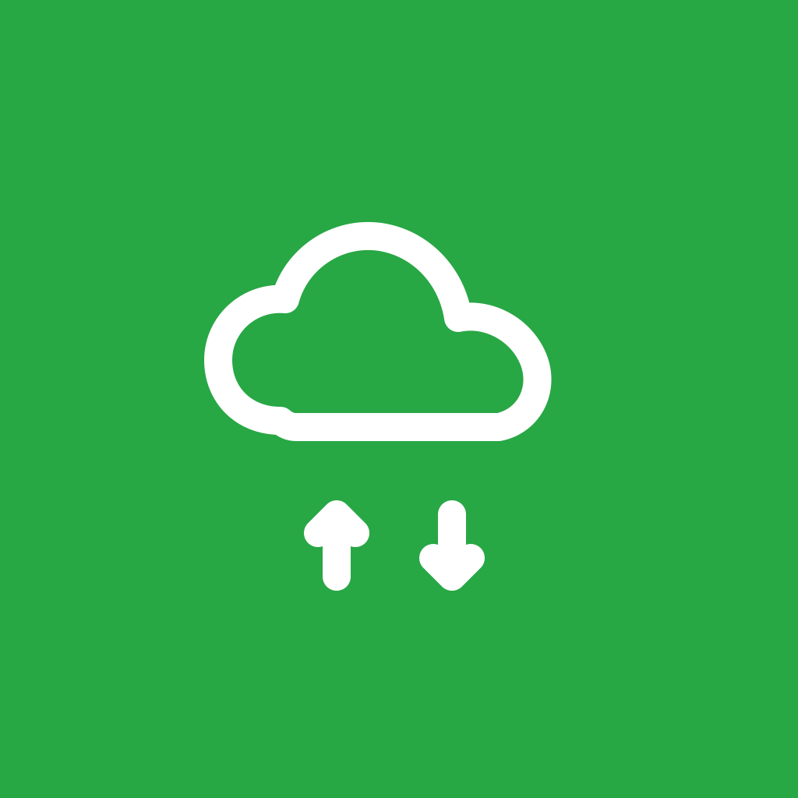

Self-hosted-Client

> Dein eigenes Nextcloud — Dateien, Kontakte, Kalender, Link-Prüfer — in einer App.

**Status: in Entwicklung.** Die App bündelt vier Nextcloud-Module unter einem Konto. Dateien (WebDAV) und der Link-Prüfer laufen bereits round-trip-fähig; Kontakte (CardDAV) und Kalender (CalDAV) sind in Arbeit. Établi Nuage spricht ausschließlich mit der konfigurierten Nextcloud-Instanz und ist nicht mit der Nextcloud GmbH affiliiert.

{width=320}

## Wer profitiert davon

Wer Nextcloud selbst hostet und unterwegs auf Dateien, Adressen und Termine zugreifen möchte, ohne die offiziellen Apps zu mischen — und für den der Link-Prüfer (zur Pflege einer URL-Liste mit Statussynchronisation zurück in die Nextcloud) ein Plus ist.

## Plattformen

| Plattform | Status |
|-----------|--------|
| iOS       | ✓      |
| Android   | ✓      |

## Datenschutz

Keine Analyse-Tools, keine Drittanbieter-SDKs. Anmeldung erfolgt am eigenen self-hosted Nextcloud-Server. Anmeldedaten (Server-URL + App-Passwort) liegen ausschließlich im Plattform-Schlüsselspeicher (iOS Keychain · Android EncryptedSharedPreferences) und gehen ausschließlich an die konfigurierte Instanz.

## Installation

Établi Nuage befindet sich **in aktiver Entwicklung** (Kontakte/CardDAV und Kalender/CalDAV werden noch fertiggestellt). Es gibt noch keine Veröffentlichung im App Store, bei Google Play oder F-Droid.

| Kanal | Status |
|-------|--------|
| Android (APK) | **Entwicklungs-Build** über [GitHub Releases](https://github.com/etabli-dev/etabli-nuage/releases) |
| App Store (iOS) | geplant — noch nicht verfügbar |
| Google Play | geplant — noch nicht verfügbar |
| F-Droid | geplant — noch nicht verfügbar |

Details siehe [Erste Schritte](getting-started.qmd).

## Hervorgegangen aus

Nuage ist die Weiterentwicklung von **EtabliProbe** (ursprünglich ein reiner WebDAV-basierter Link-Prüfer). Der Link-Prüfer ist heute eines von vier Modulen.

## Unterstützen

Wenn dir die App nützt: [Liberapay](https://liberapay.com/rabanheller/).
