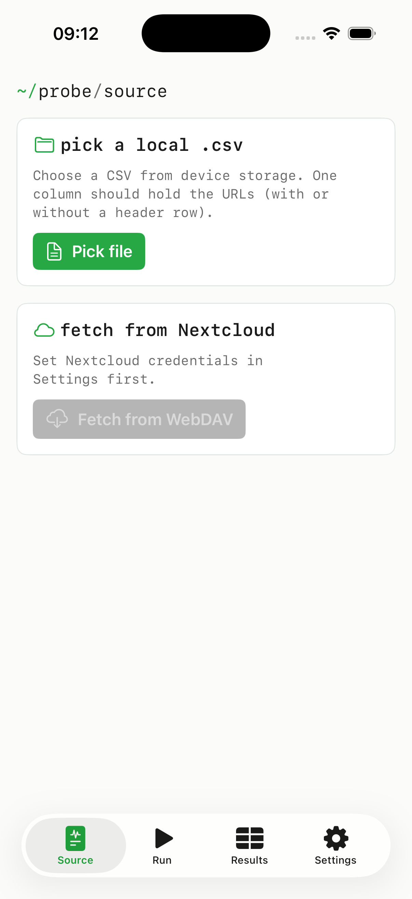
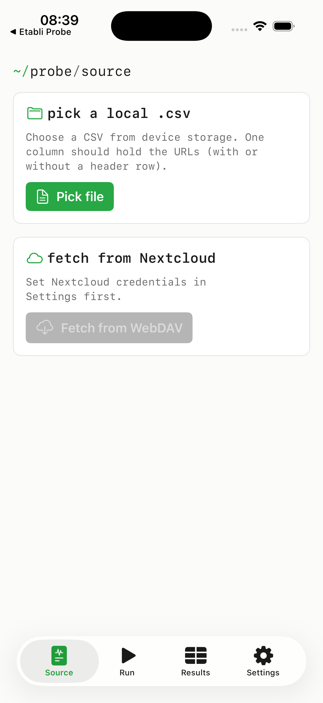

Etabli Nuage bundles four modules under a single Nextcloud account. Each module stays in its own tab; sign-in covers all of them.

{width=320}

## Module overview

| Module | Status | Purpose |
|--------|--------|---------|
| **Files** | round-trip ready | WebDAV browser for your Nextcloud files. |
| **Link Checker** | round-trip ready | Check a CSV of URLs and write the results back to Nextcloud. |
| **Contacts** | *in development* | CardDAV — being brought to production readiness. |
| **Calendar** | *in development* | CalDAV — being brought to production readiness. |

## Files (WebDAV)

| Action | Available |
|--------|-----------|
| Browse directories | ✓ |
| Download (cache + share) | ✓ |
| Upload (from Files app / photo library) | ✓ |
| Rename, move, delete | ✓ |
| Upload conflict detection | ✓ |

Endpoint: `https://<server>/remote.php/dav/files/<user>/`.

## Link Checker

Taken from EtabliProbe and re-aimed at the Nextcloud backend.

{width=320}

{width=320}

| Step | What happens |
|------|--------------|
| Load input CSV | from the Files app or the Nextcloud server. |
| Probe URLs | HEAD/GET per URL: HTTP status, final URL after redirects, response time. |
| Result | Tabular in the app, with filter by status (2xx/3xx/4xx/5xx). |
| Log sync | Result log as CSV back into a configurable Nextcloud folder. |

## Contacts (CardDAV) — *in development*

Planned: read and write address books under `/remote.php/dav/addressbooks/users/<user>/` (vCard 3 / 4), list + detail, search. While the round-trip is not yet consistently safe, the module remains explicitly marked as "in development".

## Calendar (CalDAV) — *in development*

Planned: read and write calendars under `/remote.php/dav/calendars/<user>/` (iCalendar VEVENT), month and list views. Recurring events (RRULE) are the hardest piece and the reason this module is not declared done prematurely.

## Auth & network

| Aspect | Behaviour |
|--------|-----------|
| Auth | HTTP Basic with an app password (Nextcloud standard). |
| Endpoint | only the configured Nextcloud URL. |
| Other hosts | not contacted; only the Link Checker reaches user-supplied URLs intentionally. |

## Where to get it

| Channel | App |
|---------|-----|
| App Store (iOS) · Google Play (Android) | Etabli Nuage |
| F-Droid — main repository | Etabli Nuage |
| Source code | [`etabli-dev/etabli-nuage`](https://github.com/etabli-dev/etabli-nuage) |
