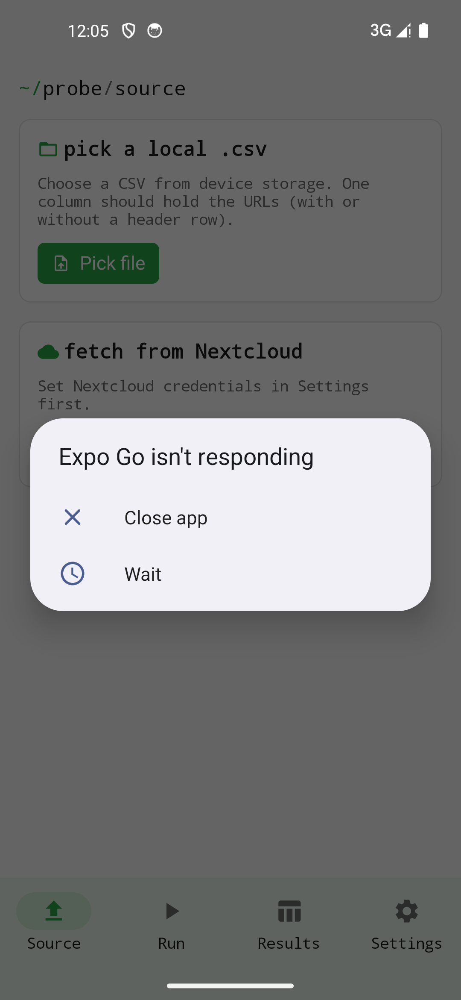

Client auto-hébergé

> Votre propre Nextcloud — fichiers, contacts, calendrier, vérificateur de liens — dans une seule appli.

**Statut : en développement.** L'appli regroupe quatre modules Nextcloud sous un même compte. Fichiers (WebDAV) et le Vérificateur de liens fonctionnent déjà en aller-retour ; Contacts (CardDAV) et Calendrier (CalDAV) sont en cours. Etabli Nuage ne parle qu'à l'instance Nextcloud configurée et n'est pas affilié à Nextcloud GmbH.

{width=320}

## À qui ça s'adresse

À toute personne hébergeant Nextcloud souhaitant accéder à ses fichiers, contacts et agendas en mobilité sans jongler avec plusieurs applis officielles — et pour qui le Vérificateur de liens (gestion d'une liste d'URL avec statut synchronisé dans Nextcloud) est un atout.

## Plateformes

| Plateforme | Statut |
|------------|--------|
| iOS        | ✓      |
| Android    | ✓      |

## Vie privée

Aucun outil d'analyse, aucun SDK tiers. L'authentification se fait sur votre serveur Nextcloud auto-hébergé. Les identifiants (URL serveur + mot de passe d'application) résident uniquement dans le coffre-fort de la plateforme (iOS Keychain · Android EncryptedSharedPreferences) et ne sont envoyés qu'à l'instance configurée.

## Installation

| Plateforme | Distribution |
|------------|--------------|
| iOS        | App Store |
| Android    | Google Play et F-Droid (dépôt principal) |

Détails : voir [Premiers pas](getting-started.qmd).

## Origine

Nuage prolonge **EtabliProbe** (à l'origine, un vérificateur de liens basé sur WebDAV). Le Vérificateur de liens est aujourd'hui l'un des quatre modules.

## Soutenir

Si l'appli vous est utile : [Liberapay](https://liberapay.com/rabanheller/) · dans l'appli même vous trouverez également un lien Buy-Me-a-Coffee.
